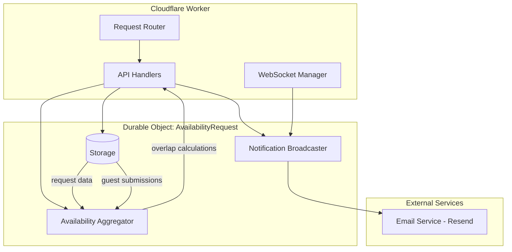

# Design Document: Group Availability Request

## Overview

The Group Availability Request feature extends the existing availability coordination system to support multi-participant scheduling. While the current system handles one-to-one availability requests and group event bookings (fixed slots), this feature enables dynamic coordination where a host collects availability from 3+ guests and identifies optimal meeting times based on overlapping availability.

The design leverages the existing Cloudflare Workers + Durable Objects architecture, extending the `AvailabilityRequest` Durable Object with new storage keys and API endpoints. The core challenge is efficiently aggregating multiple guest submissions and computing time slot overlaps while maintaining timezone accuracy.

Key design principles:
- Reuse existing infrastructure (Durable Objects, storage patterns, timezone handling)
- Maintain backward compatibility with existing request types
- Optimize for read-heavy workloads (hosts view aggregated data frequently)
- Support real-time updates via WebSocket connections
- Ensure timezone conversions are accurate across all operations

## Architecture

### System Components



### Request Flow

**Host Creates Request:**
1. Host submits form at `/new` with guest list (3+ guests)
2. Worker validates input and generates tokens (request ID, admin token, guest tokens)
3. Worker creates Durable Object instance
4. Durable Object stores request data with type "group-availability"
5. Worker returns admin URL and individual guest URLs

**Guest Submits Availability:**
1. Guest accesses `/r/:id?guest=:guestToken`
2. Worker fetches request data from Durable Object
3. Guest sees availability form in their local timezone
4. Guest submits time ranges
5. Durable Object validates and stores submission
6. Durable Object broadcasts WebSocket notification to admin clients
7. Durable Object triggers email notification to host (if enabled)

**Host Views Aggregated Availability:**
1. Host accesses `/r/:id?admin=:adminToken`
2. Worker fetches request and all guest submissions
3. Aggregator computes time slot overlaps
4. Worker renders aggregated view with participation counts
5. WebSocket connection established for real-time updates

**Host Confirms Meeting Time:**
1. Host selects time slot and provides meeting details
2. Worker validates selection against guest availability
3. Durable Object stores confirmed slot
4. Durable Object sends confirmation emails to all guests
5. Request marked as confirmed, further submissions blocked

## Components and Interfaces

### Extended Type Definitions

```typescript
// Extend existing RequestData type
export type RequestData = {
  id: string;
  adminToken: string;
  hostName: string;
  hostTimezone: string;
  allowedDateStart: string;
  allowedDateEnd: string;
  allowedTimeWindows: AllowedWindow[];
  createdAt: string;
  type: "individual" | "group" | "group-availability";
  
  // Group availability specific fields
  guests?: GuestInfo[];
  participationThreshold?: number;
  confirmed?: boolean;
  
  // Legacy fields (for backward compatibility)
  guestName?: string;
  guestEmail?: string;
  eventTitle?: string;
  slotDurationMinutes?: number;
  bufferMinutes?: number;
};

export type GuestInfo = {
  token: string;
  name: string;
  email: string;
  invitedAt: string;
};

export type GuestSubmission = {
  guestToken: string;
  availability: { startUtc: string; endUtc: string }[];
  guestTimezone: string;
  submittedAt: string;
  updatedAt?: string;
};

export type GroupSubmissionsData = {
  submissions: GuestSubmission[];
};

export type TimeSlot = {
  startUtc: string;
  endUtc: string;
  participantCount: number;
  participantTokens: string[];
};

export type AggregatedAvailability = {
  slots: TimeSlot[];
  totalGuests: number;
  submittedCount: number;
  maxParticipation: number;
};
```

### Storage Schema

The Durable Object will use the following storage keys:

- `"request"`: RequestData (existing, extended with new fields)
- `"group-submissions"`: GroupSubmissionsData (new, stores all guest submissions)
- `"confirmed"`: ConfirmedSlot (existing, reused)
- `"aggregated-cache"`: AggregatedAvailability (new, cached computation)
- `"cache-timestamp"`: string (new, invalidation timestamp)

### API Endpoints

**New Endpoints:**

```
POST /api/group-request
  Body: { hostName, hostTimezone, guests: [{ name, email }], allowedDateStart, allowedDateEnd, allowedTimeWindows?, participationThreshold? }
  Returns: { requestId, adminUrl, guestUrls: [{ name, email, url }] }

GET /api/request/:id/guest?guest=:guestToken
  Returns: { requestId, guestName, hostName, hostTimezone, allowedDateStart, allowedDateEnd, allowedTimeWindows, hasSubmitted, existingSubmission? }

POST /api/request/:id/guest-submit?guest=:guestToken
  Body: { availability: [{ startUtc, endUtc }], guestTimezone }
  Returns: { ok: true }

GET /api/request/:id/aggregated?admin=:adminToken
  Returns: AggregatedAvailability + guest submission status

POST /api/request/:id/confirm?admin=:adminToken
  Body: { startUtc, endUtc, title, description?, location? }
  Returns: { ok: true }
```

**Modified Endpoints:**

```
GET /api/request/:id
  - Add support for guest token parameter
  - Return guest-specific view when guest token provided
  - Return admin view when admin token provided
```

### Availability Aggregator Component

The aggregator is responsible for computing time slot overlaps from multiple guest submissions.

**Algorithm:**

```typescript
function aggregateAvailability(
  submissions: GuestSubmission[],
  allowedWindows: AllowedWindow[],
  hostTimezone: string,
  minDuration: number = 30
): AggregatedAvailability {
  // 1. Collect all unique time boundaries from submissions
  const boundaries = new Set<number>();
  for (const sub of submissions) {
    for (const range of sub.availability) {
      boundaries.add(Date.parse(range.startUtc));
      boundaries.add(Date.parse(range.endUtc));
    }
  }
  
  // 2. Sort boundaries chronologically
  const sortedBoundaries = Array.from(boundaries).sort((a, b) => a - b);
  
  // 3. For each interval between boundaries, count participants
  const slots: TimeSlot[] = [];
  for (let i = 0; i < sortedBoundaries.length - 1; i++) {
    const start = sortedBoundaries[i];
    const end = sortedBoundaries[i + 1];
    
    // Skip intervals shorter than minimum duration
    if (end - start < minDuration * 60 * 1000) continue;
    
    // Count how many guests are available in this interval
    const participants: string[] = [];
    for (const sub of submissions) {
      if (isAvailableDuring(sub, start, end)) {
        participants.push(sub.guestToken);
      }
    }
    
    if (participants.length > 0) {
      slots.push({
        startUtc: new Date(start).toISOString(),
        endUtc: new Date(end).toISOString(),
        participantCount: participants.length,
        participantTokens: participants,
      });
    }
  }
  
  // 4. Sort by participation count (descending), then by start time
  slots.sort((a, b) => {
    if (b.participantCount !== a.participantCount) {
      return b.participantCount - a.participantCount;
    }
    return Date.parse(a.startUtc) - Date.parse(b.startUtc);
  });
  
  return {
    slots,
    totalGuests: submissions.length,
    submittedCount: submissions.length,
    maxParticipation: Math.max(...slots.map(s => s.participantCount), 0),
  };
}

function isAvailableDuring(
  submission: GuestSubmission,
  startMs: number,
  endMs: number
): boolean {
  for (const range of submission.availability) {
    const rangeStart = Date.parse(range.startUtc);
    const rangeEnd = Date.parse(range.endUtc);
    
    // Check if [startMs, endMs] is fully contained within [rangeStart, rangeEnd]
    if (rangeStart <= startMs && endMs <= rangeEnd) {
      return true;
    }
  }
  return false;
}
```

**Caching Strategy:**

- Compute aggregated availability on first request
- Store result in `"aggregated-cache"` with timestamp
- Invalidate cache when new submission received
- Recompute on next admin request after invalidation

### WebSocket Notification Format

```typescript
type AdminNotification = 
  | { type: "guest-submission"; action: "new" | "updated"; guestName: string; guestToken: string; submittedAt: string }
  | { type: "confirmation"; startUtc: string; endUtc: string; title: string };
```

## Data Models

### Database Schema (Durable Object Storage)

**Request Data:**
```typescript
{
  id: "req_abc123",
  adminToken: "admin_xyz789",
  hostName: "Alice",
  hostTimezone: "America/New_York",
  allowedDateStart: "2024-03-01",
  allowedDateEnd: "2024-03-15",
  allowedTimeWindows: [
    { startTime: "09:00", endTime: "17:00" }
  ],
  createdAt: "2024-02-15T10:00:00Z",
  type: "group-availability",
  guests: [
    { token: "guest_aaa", name: "Bob", email: "bob@example.com", invitedAt: "2024-02-15T10:00:00Z" },
    { token: "guest_bbb", name: "Carol", email: "carol@example.com", invitedAt: "2024-02-15T10:00:00Z" },
    { token: "guest_ccc", name: "Dave", email: "dave@example.com", invitedAt: "2024-02-15T10:00:00Z" }
  ],
  participationThreshold: 3,
  confirmed: false
}
```

**Group Submissions Data:**
```typescript
{
  submissions: [
    {
      guestToken: "guest_aaa",
      availability: [
        { startUtc: "2024-03-05T14:00:00Z", endUtc: "2024-03-05T16:00:00Z" },
        { startUtc: "2024-03-06T13:00:00Z", endUtc: "2024-03-06T17:00:00Z" }
      ],
      guestTimezone: "America/Los_Angeles",
      submittedAt: "2024-02-16T08:30:00Z"
    },
    {
      guestToken: "guest_bbb",
      availability: [
        { startUtc: "2024-03-05T14:30:00Z", endUtc: "2024-03-05T18:00:00Z" }
      ],
      guestTimezone: "Europe/London",
      submittedAt: "2024-02-16T09:15:00Z",
      updatedAt: "2024-02-16T10:00:00Z"
    }
  ]
}
```

**Aggregated Availability (Cached):**
```typescript
{
  slots: [
    {
      startUtc: "2024-03-05T14:30:00Z",
      endUtc: "2024-03-05T16:00:00Z",
      participantCount: 2,
      participantTokens: ["guest_aaa", "guest_bbb"]
    },
    {
      startUtc: "2024-03-05T14:00:00Z",
      endUtc: "2024-03-05T14:30:00Z",
      participantCount: 1,
      participantTokens: ["guest_aaa"]
    }
  ],
  totalGuests: 3,
  submittedCount: 2,
  maxParticipation: 2
}
```

### Data Validation Rules

1. **Request Creation:**
   - Minimum 3 guests required
   - Maximum 50 guests allowed
   - All guest emails must be unique
   - Date range must not exceed 60 days
   - Time windows must have start < end

2. **Guest Submission:**
   - Guest token must match an invited guest
   - Availability ranges must not overlap within submission
   - All times must fall within allowed windows (after timezone conversion)
   - At least one time range required

3. **Meeting Confirmation:**
   - Admin token required
   - Confirmed slot must overlap with at least one guest's availability
   - Cannot confirm if request already confirmed
   - Title required, description and location optional


## Correctness Properties

A property is a characteristic or behavior that should hold true across all valid executions of a system—essentially, a formal statement about what the system should do. Properties serve as the bridge between human-readable specifications and machine-verifiable correctness guarantees.

### Input Validation Properties

**Property 1: Minimum guest count enforcement**  
*For any* group availability request creation attempt, if the guest list contains fewer than 3 guests, the system should reject the request with a 400 error.  
**Validates: Requirements 1.1**

**Property 2: Maximum guest count enforcement**  
*For any* group availability request creation attempt, if the guest list contains more than 50 guests, the system should reject the request with a 400 error.  
**Validates: Requirements 14.5**

**Property 3: Date range validation**  
*For any* group availability request creation attempt, if the date range exceeds 60 days, the system should reject the request with a 400 error.  
**Validates: Requirements 1.6**

**Property 4: Time window validation**  
*For any* group availability request with time windows, all windows should have start times before end times, otherwise the request should be rejected.  
**Validates: Requirements 1.7**

**Property 5: Email format validation**  
*For any* guest email address in a request, if the email does not match standard email format (contains @ and domain), the system should reject the request.  
**Validates: Requirements 13.6**

**Property 6: Timezone identifier validation**  
*For any* request or submission, if the timezone identifier is not a valid IANA timezone name, the system should reject the input with a 400 error.  
**Validates: Requirements 12.5**

### Token Uniqueness Properties

**Property 7: Token uniqueness across request**  
*For any* created group availability request, the request ID, admin token, and all guest tokens should be mutually unique (no duplicates within or across these sets).  
**Validates: Requirements 1.3, 1.4, 2.1**

**Property 8: Guest token to identity mapping**  
*For any* group availability request, each guest token should map to exactly one (email, name) pair, and each email should map to exactly one guest token.  
**Validates: Requirements 2.4**

### Request Creation Properties

**Property 9: Valid request acceptance**  
*For any* group availability request with valid inputs (3-50 guests, valid date range, valid time windows, valid timezones), the system should accept and store the request successfully.  
**Validates: Requirements 1.2**

**Property 10: Request type marking**  
*For any* created group availability request, the stored request data should have type field set to "group-availability".  
**Validates: Requirements 1.5**

**Property 11: Guest URL generation**  
*For any* group availability request with N guests, the system should generate exactly N unique guest URLs, one for each guest.  
**Validates: Requirements 1.4**

### Guest Access and Privacy Properties

**Property 12: Guest data isolation**  
*For any* guest accessing their unique URL, the response should contain only that guest's name and submission data, not other guests' names, emails, or submissions.  
**Validates: Requirements 2.2**

**Property 13: Guest submission access**  
*For any* guest with a valid guest token who has submitted availability, accessing their URL should return their existing submission data.  
**Validates: Requirements 2.5**

### Submission Validation Properties

**Property 14: Non-overlapping ranges validation**  
*For any* guest submission, if the availability ranges overlap within the submission, the system should reject it with a 400 error.  
**Validates: Requirements 3.2**

**Property 15: Timezone round-trip consistency**  
*For any* guest submission with availability in their local timezone, converting to UTC for storage and then converting back to the original timezone should produce equivalent times (within 1 second tolerance).  
**Validates: Requirements 3.3, 12.4**

**Property 16: Timezone storage invariant**  
*For any* stored guest submission, it should contain a guestTimezone field with a valid IANA timezone identifier.  
**Validates: Requirements 3.4**

**Property 17: Allowed window boundary validation**  
*For any* guest submission, if any availability range falls outside the host-defined allowed windows (after timezone conversion), the system should reject the submission.  
**Validates: Requirements 3.5, 13.4**

**Property 18: Submission update semantics**  
*For any* guest who submits availability twice with the same guest token, only the most recent submission should be stored, and it should have an updatedAt timestamp.  
**Validates: Requirements 3.7**

### Submission Status Properties

**Property 19: Submission status derivation**  
*For any* group availability request, guests with stored submissions should have status "submitted" with a timestamp, and guests without submissions should have status "pending".  
**Validates: Requirements 4.2, 4.3, 4.4**

**Property 20: Guest count invariant**  
*For any* group availability request, the sum of submitted guest count and pending guest count should equal the total number of invited guests.  
**Validates: Requirements 4.5**

**Property 21: Admin dashboard data completeness**  
*For any* admin request for guest status, the response should include all invited guests with their names and submission status.  
**Validates: Requirements 4.1**

### Aggregation Algorithm Properties

**Property 22: Participation count accuracy**  
*For any* time slot in the aggregated availability, the participantCount should equal the number of guest tokens in the participantTokens array, and each token should correspond to a guest whose availability overlaps that entire slot.  
**Validates: Requirements 5.2, 6.1**

**Property 23: Overlap calculation correctness**  
*For any* two or more guests with overlapping availability, the aggregated view should contain time slots representing the intersection of their available times.  
**Validates: Requirements 5.3**

**Property 24: Participant identification**  
*For any* time slot in the aggregated availability, the participantTokens array should contain exactly the guest tokens of guests whose submitted availability fully contains that time slot.  
**Validates: Requirements 5.5**

**Property 25: Full participation identification**  
*For any* group availability request with N guests where N guests have submitted, time slots where participantCount equals N should be correctly identified as full-participation slots.  
**Validates: Requirements 6.2**

**Property 26: Participation sorting**  
*For any* aggregated availability result, the time slots should be sorted in descending order by participantCount, with ties broken by ascending startUtc.  
**Validates: Requirements 6.3**

**Property 27: Maximum participation identification**  
*For any* aggregated availability result, the maxParticipation field should equal the highest participantCount among all slots.  
**Validates: Requirements 6.4**

**Property 28: Participation threshold filtering**  
*For any* aggregated availability filtered by minimum participation threshold T, all returned slots should have participantCount >= T.  
**Validates: Requirements 6.5**

**Property 29: Minimum duration filtering**  
*For any* aggregated availability result, all time slots should have duration of at least 30 minutes.  
**Validates: Requirements 6.6**

### Confirmation Properties

**Property 30: Confirmation authorization**  
*For any* confirmation attempt without a valid admin token, the system should reject the request with a 403 error.  
**Validates: Requirements 7.1, 11.3**

**Property 31: Confirmation title requirement**  
*For any* confirmation attempt without a meeting title, the system should reject the request with a 400 error.  
**Validates: Requirements 7.2**

**Property 32: Confirmation optional fields**  
*For any* confirmation attempt with valid required fields (startUtc, endUtc, title), the system should accept the confirmation regardless of whether description and location are provided.  
**Validates: Requirements 7.3**

**Property 33: Confirmation state transition**  
*For any* successful meeting confirmation, the stored request should have confirmed=true, the confirmed slot should be stored with all provided fields plus a confirmedAt timestamp, and subsequent guest submissions should be rejected.  
**Validates: Requirements 7.4, 7.5**

**Property 34: Confirmation overlap validation**  
*For any* confirmation attempt, if the specified time slot does not overlap with at least one guest's submitted availability, the system should reject the confirmation.  
**Validates: Requirements 7.6**

**Property 35: Confirmation with disabled emails**  
*For any* confirmation attempt when email notifications are disabled, the confirmation should succeed and store the confirmed slot without sending emails.  
**Validates: Requirements 8.5**

### Export Properties

**Property 36: Export completeness**  
*For any* export request with valid admin token, the generated export should include all guest submissions with guest names, timezones, and availability ranges.  
**Validates: Requirements 10.1, 10.3**

**Property 37: ICS format validity**  
*For any* export in .ics format, the generated file should be valid iCalendar format and contain one event per availability range from all submissions.  
**Validates: Requirements 10.2**

**Property 38: Export availability before confirmation**  
*For any* group availability request that has not been confirmed, the export operation should succeed and include all submitted availability.  
**Validates: Requirements 10.4**

**Property 39: Export includes confirmation**  
*For any* group availability request with a confirmed meeting time, the export should include the confirmed slot in addition to all guest submissions.  
**Validates: Requirements 10.5**

### Request Management Properties

**Property 40: Edit before submissions**  
*For any* group availability request with zero guest submissions, the host should be able to update request details (guest list, date range, time windows) successfully.  
**Validates: Requirements 11.1**

**Property 41: Deletion completeness**  
*For any* group availability request that is deleted with valid admin token, all associated storage keys (request, group-submissions, confirmed, aggregated-cache) should be removed.  
**Validates: Requirements 11.4**

**Property 42: Confirmed request deletion prevention**  
*For any* group availability request with confirmed=true, deletion attempts should be rejected with a 400 error.  
**Validates: Requirements 11.5**

### Data Format Properties

**Property 43: UTC and IANA storage format**  
*For any* stored request or submission, all timestamp fields should be valid ISO 8601 UTC strings, and all timezone fields should be valid IANA timezone identifiers.  
**Validates: Requirements 12.1, 12.2**

**Property 44: DST-aware timezone conversion**  
*For any* allowed time window converted from host timezone to guest timezone, if the date range crosses a daylight saving time boundary, the conversion should correctly account for the time offset change.  
**Validates: Requirements 12.3**

### Error Handling Properties

**Property 45: Invalid input error codes**  
*For any* API request with invalid input data (malformed JSON, missing required fields, invalid formats), the system should return a 400 status code with a descriptive error message.  
**Validates: Requirements 13.1**

**Property 46: Unauthorized action error codes**  
*For any* admin-only operation attempted without a valid admin token, the system should return a 403 status code.  
**Validates: Requirements 13.3**

**Property 47: XSS prevention**  
*For any* user input containing HTML/JavaScript special characters (<, >, &, ", '), the system should either escape these characters or reject the input to prevent XSS attacks.  
**Validates: Requirements 13.7**

### Caching Properties

**Property 48: Aggregation cache invalidation**  
*For any* group availability request, if a new guest submission is stored, the next aggregated availability request should recompute the aggregation (not return stale cached data).  
**Validates: Requirements 14.3**

**Property 49: Concurrent submission safety**  
*For any* group availability request receiving multiple guest submissions concurrently (different guest tokens), all submissions should be stored correctly without data loss.  
**Validates: Requirements 14.4**

## Error Handling

### Error Response Format

All API errors follow a consistent JSON format:

```typescript
{
  error: string;           // Human-readable error message
  code?: string;           // Optional error code for programmatic handling
  details?: unknown;       // Optional additional context
}
```

### HTTP Status Codes

- **400 Bad Request**: Invalid input, validation failures, business rule violations
- **403 Forbidden**: Missing or invalid authentication token
- **404 Not Found**: Request ID or guest token not found
- **409 Conflict**: Duplicate submission, already confirmed, etc.
- **500 Internal Server Error**: Unexpected storage or system errors

### Validation Error Messages

The system provides specific error messages for common validation failures:

- "Minimum 3 guests required for group availability requests"
- "Maximum 50 guests allowed per request"
- "Date range cannot exceed 60 days"
- "Time window start must be before end"
- "Invalid email format: {email}"
- "Invalid timezone identifier: {timezone}"
- "Availability ranges must not overlap"
- "Availability must fall within allowed time windows"
- "Meeting title is required for confirmation"
- "Cannot confirm: selected time does not overlap with any guest availability"
- "Cannot submit: request has been confirmed"
- "Cannot delete: request has been confirmed"

### Error Recovery Strategies

1. **Validation Errors (400)**: Client should correct input and retry
2. **Authentication Errors (403)**: Client should verify token and retry
3. **Not Found Errors (404)**: Client should verify URL and request ID
4. **Conflict Errors (409)**: Client should refresh state and decide next action
5. **Server Errors (500)**: Client should implement exponential backoff retry

### Graceful Degradation

- **Email Service Unavailable**: Confirmation succeeds, email sending fails silently (logged)
- **WebSocket Connection Lost**: Admin dashboard falls back to polling or manual refresh
- **Cache Corruption**: System recomputes aggregation from source data

## Testing Strategy

### Dual Testing Approach

The testing strategy employs both unit tests and property-based tests as complementary approaches:

- **Unit tests**: Verify specific examples, edge cases, and error conditions
- **Property tests**: Verify universal properties across randomized inputs
- Together they provide comprehensive coverage: unit tests catch concrete bugs, property tests verify general correctness

### Property-Based Testing Configuration

**Framework**: fast-check (TypeScript property-based testing library)

**Configuration**:
- Minimum 100 iterations per property test (due to randomization)
- Each property test references its design document property via comment tag
- Tag format: `// Feature: group-availability-request, Property {number}: {property_text}`

**Example Property Test Structure**:

```typescript
import fc from 'fast-check';
import { describe, it, expect } from 'vitest';

describe('Group Availability Request - Property Tests', () => {
  it('Property 1: Minimum guest count enforcement', () => {
    // Feature: group-availability-request, Property 1: Minimum guest count enforcement
    fc.assert(
      fc.property(
        fc.record({
          hostName: fc.string({ minLength: 1 }),
          hostTimezone: fc.constantFrom('America/New_York', 'Europe/London', 'Asia/Tokyo'),
          guests: fc.array(
            fc.record({
              name: fc.string({ minLength: 1 }),
              email: fc.emailAddress(),
            }),
            { maxLength: 2 } // Less than minimum of 3
          ),
          allowedDateStart: fc.date(),
          allowedDateEnd: fc.date(),
        }),
        async (requestData) => {
          const response = await createGroupRequest(requestData);
          expect(response.status).toBe(400);
          expect(response.error).toContain('Minimum 3 guests required');
        }
      ),
      { numRuns: 100 }
    );
  });
});
```

### Unit Testing Focus Areas

Unit tests should focus on:

1. **Specific Examples**: Concrete scenarios that demonstrate correct behavior
   - Creating a request with exactly 3 guests
   - Submitting availability that exactly matches allowed windows
   - Confirming a time slot with full participation

2. **Edge Cases**: Boundary conditions and special cases
   - Empty availability submission (should be rejected)
   - Non-existent request ID (404 error)
   - Submission after confirmation (should be rejected)
   - Date range crossing DST boundary

3. **Integration Points**: Component interactions
   - WebSocket notification delivery after submission
   - Email sending after confirmation (with mocked email service)
   - Cache invalidation after new submission

4. **Error Conditions**: Specific error scenarios
   - Invalid JSON in request body
   - Malformed UTC timestamp
   - XSS attempt in guest name field

### Test Data Generators

For property-based tests, implement custom generators:

```typescript
// Generate valid IANA timezone
const timezoneArb = fc.constantFrom(
  'America/New_York', 'America/Los_Angeles', 'Europe/London',
  'Europe/Paris', 'Asia/Tokyo', 'Asia/Shanghai', 'Australia/Sydney'
);

// Generate valid date range (max 60 days)
const dateRangeArb = fc.date().chain(start => 
  fc.date({ min: start, max: addDays(start, 60) }).map(end => ({ start, end }))
);

// Generate valid time window
const timeWindowArb = fc.record({
  startTime: fc.constantFrom('00:00', '09:00', '12:00', '14:00'),
  endTime: fc.constantFrom('12:00', '17:00', '20:00', '23:59'),
}).filter(w => w.startTime < w.endTime);

// Generate valid guest list (3-50 guests)
const guestListArb = fc.array(
  fc.record({
    name: fc.string({ minLength: 1, maxLength: 50 }),
    email: fc.emailAddress(),
  }),
  { minLength: 3, maxLength: 50 }
).map(guests => {
  // Ensure unique emails
  const uniqueEmails = new Map();
  return guests.filter(g => {
    if (uniqueEmails.has(g.email)) return false;
    uniqueEmails.set(g.email, true);
    return true;
  });
});
```

### Coverage Goals

- **Line Coverage**: Minimum 80% for all source files
- **Branch Coverage**: Minimum 75% for conditional logic
- **Property Coverage**: All testable acceptance criteria (49 properties) implemented
- **Edge Case Coverage**: All identified edge cases have explicit unit tests

### Continuous Integration

- Run all tests on every commit
- Run property tests with 1000 iterations on main branch merges
- Generate coverage reports and fail if below thresholds
- Run tests against local Miniflare environment (simulates Cloudflare Workers)
