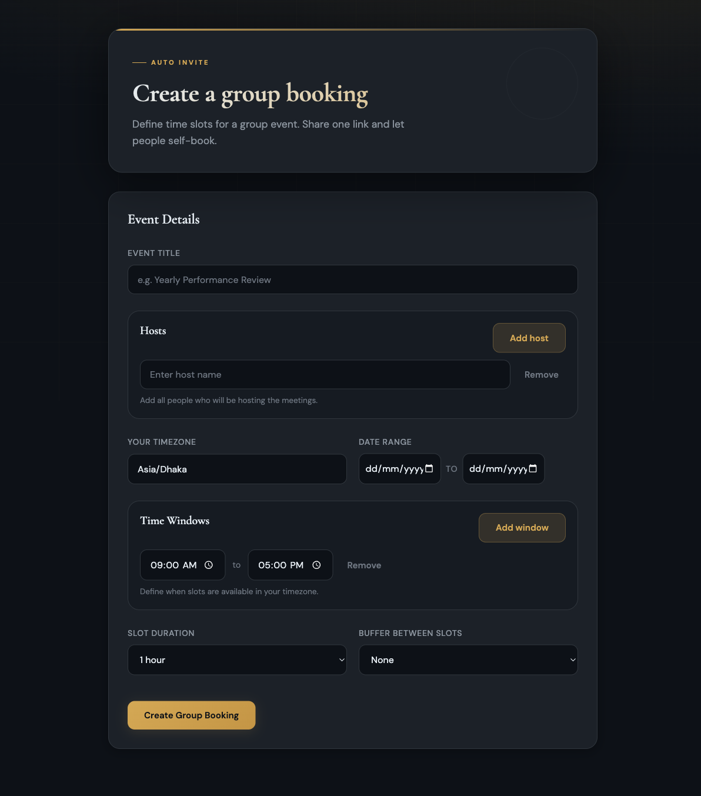
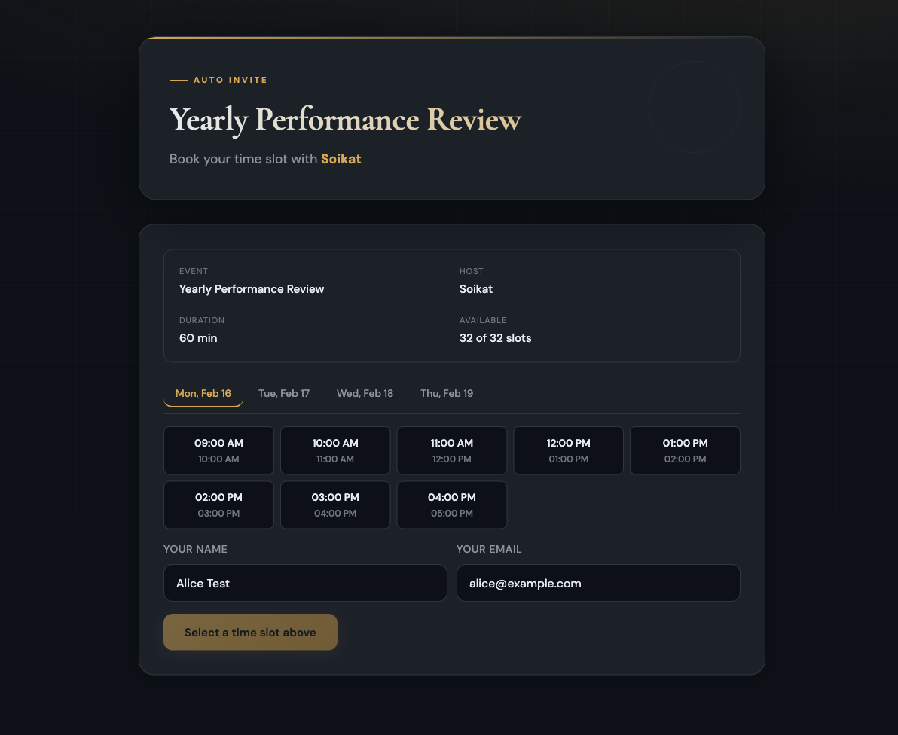

# Auto Invite

Collect guest availability across timezones. Hosts create booking requests with date/time constraints, guests pick a slot, and hosts review everything from an admin dashboard.





## Usage

### Individual availability request

1. Go to `/new` and fill in your name, timezone, date range, and time windows
2. Share the generated guest link — guests see the time slots converted to their local timezone
3. Use the admin link to review submissions

### Group slot booking

1. Go to `/new/group` to create a group event with an event title, hosts, date range, time windows, and slot duration
2. Share the guest link — guests pick an available slot and enter their name and email to book it
3. Use the admin link for a live dashboard with booking stats, a schedule grid, and a table of all bookings

### Routes

| Route | Description |
|---|---|
| `/new` | Create an individual availability request |
| `/new/group` | Create a group slot booking |
| `/r/<token>` | Guest availability form |
| `/g/<token>` | Guest slot booking page |
| `/r/<token>?admin=<adminToken>` | Individual admin view |
| `/g/<token>?admin=<adminToken>` | Group admin dashboard |

## Local dev

1. Install dependencies: `npm install`
2. Start the dev server: `npm run dev`
3. Open `http://localhost:8787/new`

## Deploy

```bash
npm run deploy
```

## Environment variables

Optional:
- `NOTIFY_WEBHOOK_URL` — If set, the worker POSTs a JSON payload when a guest submits availability or books a slot.

## Durable Objects

This project uses a single Durable Object class:
- `AvailabilityRequest` — one instance per request, stores request config, submissions, and bookings
